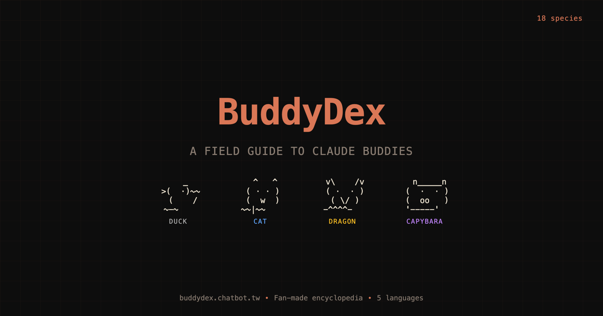

<!-- Language: English | [正體中文](README.zh-TW.md) -->

> [!CAUTION]
> **Archived project.** Anthropic removed the `/buddy` feature from Claude Code in an update on April 9, 2026. The buddy species, mechanics, and ASCII art documented here no longer exist in the product. This site is preserved as a historical archive — no further feature development is planned.

# BuddyDex

**A historical field guide to Claude Code's buddy companions**

The encyclopedia of all 18 ASCII pet species, their rarity tiers, accessories, and stats — preserved from when `/buddy` was still part of Claude Code.

=22">

 

---

## What is this?

BuddyDex was a fan-made encyclopedia of the 18 ASCII pet companions available through Claude Code's `/buddy` command. Users could hatch a buddy with randomized species, rarity, stats, and accessories. This site documented every species, let visitors try on different configurations, and provided community-gathered customization tips.

When Anthropic retired `/buddy` on April 9, 2026, the site was archived with its original Claude Code ASCII art restored for historical accuracy.

## Features

- **Species Gallery** — All 18 buddy species with two-frame idle animations
- **Try-On Detail View** — Switch rarity, toggle shiny, swap eyes and hats in real time
- **Five-Stat Display** — Debugging, Patience, Chaos, Wisdom, Snark with ASCII progress bars
- **Share Links** — URL hash deep links (`#duck`, `#dragon`) with copy-to-clipboard and Web Share API
- **Random Explorer** — "Surprise me" button with no-repeat guarantee
- **Customization Guide** — Community-discovered tips for changing buddy name, personality, and language
- **Multilingual** — English, 正體中文, 简体中文, 日本語, 한국어 with auto-detection
- **Accessible** — Keyboard navigation, focus traps, ARIA live regions, `prefers-reduced-motion`

## Technical Highlights

This project served as a proving ground for strict web security and accessibility practices on a zero-framework static site:

| Area                        | Implementation                                                                                                                                  |
| --------------------------- | ----------------------------------------------------------------------------------------------------------------------------------------------- |
| **Content Security Policy** | Strict CSP without `style-src 'unsafe-inline'`. Dynamic CSS values use constructable `CSSStyleSheet` with Safari < 16.4 feature-detect fallback |
| **XSS prevention**          | URL hash treated as untrusted input: `decodeURIComponent` + allowlist + never touches `innerHTML`                                               |
| **Accessibility**           | Focus trap in modal, `aria-live` announcer pattern (never on animating elements), 44px touch targets, `prefers-reduced-motion`                  |
| **i18n integrity**          | 5-language parity enforced by CI — data-integrity tests fail on any missing translation key                                                     |
| **Testing**                 | 47 Vitest tests covering hash validation, stat generation, accessory logic, and structural invariants                                           |
| **Review process**          | 6 rounds of devil's advocate review (5 Critical, 18 Major findings — all resolved). Full review chain in `docs/`                                |

## Documentation

| Document                                         | Description                                                                 |
| ------------------------------------------------ | --------------------------------------------------------------------------- |
| [`DESIGN.md`](DESIGN.md)                         | Living design system (colors, typography, rarity treatments, decisions log) |
| [`CHANGELOG.md`](CHANGELOG.md)                   | Full release history (v1.0.0 through v1.5.1)                                |
| [`CLAUDE.md`](CLAUDE.md)                         | Agent guide encoding constraints from 6 review rounds                       |
| [`docs/prd.md`](docs/prd.md)                     | Product requirements document (archived at v2.5)                            |
| [`docs/research/`](docs/research/)               | Encyclopedia benchmarks and competitive analysis                            |
| [`docs/devils-advocate-review-round*.md`](docs/) | The complete review-response chain                                          |

## Data Sources

- **Species, rarity, accessories, stats**: Based on publicly available community documentation of the Claude Code buddy feature
- **ASCII art**: Restored from the original Claude Code buddy system (`sprites.ts`) for historical accuracy. Initially replaced with original fan-art while `/buddy` was an active feature; reinstated after the feature's retirement on 2026-04-09

## Tech Stack

- Pure HTML + CSS + JavaScript (ES modules, no framework, no build step)
- CSS custom properties for theming
- Vitest for unit testing (47 tests, ~500ms)
- GitHub Actions CI on Node 22 LTS
- Deployed on Vercel with strict security headers

## Forking

If you want to build something similar, fork freely under the MIT license. Remember to replace the Google Analytics ID (`G-1CTR65SW2P` in `js/analytics.js`) with your own or remove it entirely.

## Disclaimer

This is an **unofficial fan project**. It is not affiliated with, endorsed by, or sponsored by Anthropic, PBC.

"Claude", "Claude Code", and "Claude Buddy" are trademarks or product names of Anthropic, PBC. All rights to those names and the underlying buddy system belong to Anthropic.

If Anthropic believes any content in this project infringes on their intellectual property, please [open an issue](https://github.com/Clementtang/buddydex/issues) and it will be promptly addressed.

## License

Source code (HTML, CSS, JavaScript) is released under the [MIT License](LICENSE). Buddy species names and game mechanics originate from Anthropic's Claude Code and remain their intellectual property. The ASCII art is from the original Claude Code buddy system, used here for historical documentation purposes.

---

Built by [Clement Tang](https://github.com/Clementtang) | Powered by [Claude Code](https://claude.ai/code)

